# Task 3

```sql
-- rq 2, ordered list 1.
CREATE DATABASE member;

USE member;

-- rq 2, ordered list 2.
CREATE TABLE member (
  id bigint NOT NULL AUTO_INCREMENT,
  name varchar(255) NOT NULL,
  username varchar(255) NOT NULL,
  password varchar(255) NOT NULL,
  follower_count int unsigned NOT NULL DEFAULT 0,
  time datetime NOT NULL DEFAULT CURRENT_TIMESTAMP,
  PRIMARY KEY (id)
);
-- rq 3
--unordered list bulletpoint 1
INSERT INTO member (name, username, password, follower_count, time) VALUES
('Test Test', 'test', 'test', 1010, NOW()),
('Steward Tsou', 'stewardtsou', '379', 12000, NOW()),
('Bob Marley', 'bobmarley', '0101', 99999, NOW()),
('Wes Anderson', 'wesanderson', '9090', 12345678, NOW()),
('Harry Potter', 'harrypotter', '5050', 929292, NOW());

--unordered list bulletpoint 2
SELECT * FROM member;

--unordered list bulletpoint 3
-- time DESC means time in descending order 由近到遠
SELECT * FROM member ORDER BY time DESC;

--unordered list bulletpoint 4
-- 2nd row to 4th row
SELECT * FROM member ORDER BY time DESC LIMIT 1, 3;

--unordered list bulletpoint 5
SELECT * FROM member WHERE username = 'test';

--unordered list bulletpoint 6
SELECT * FROM member WHERE username = 'test' AND password = 'test';

--unordered list bulletpoint 7
UPDATE member SET name = 'test2' WHERE username = 'test';

```

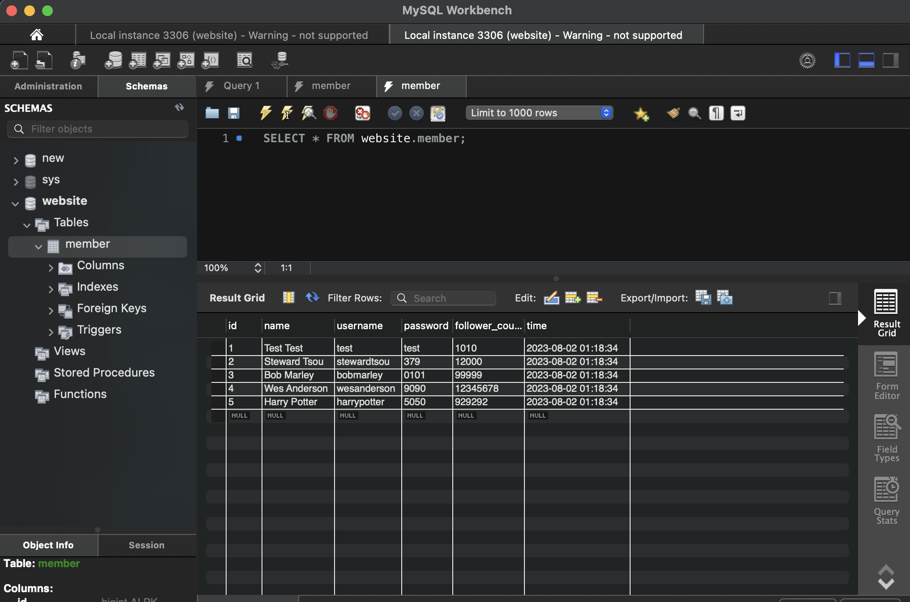

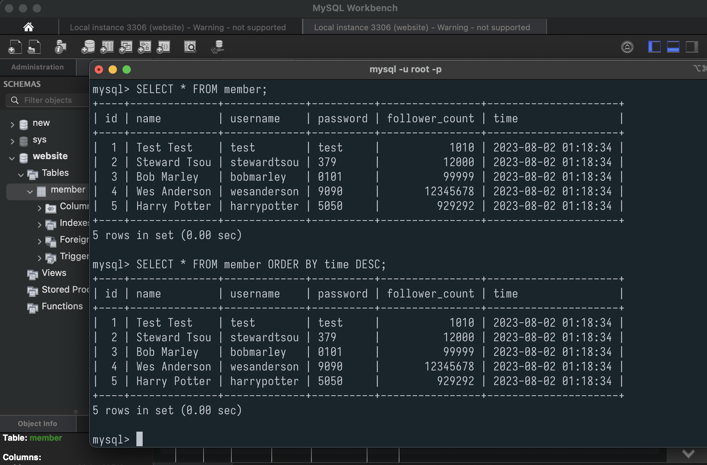

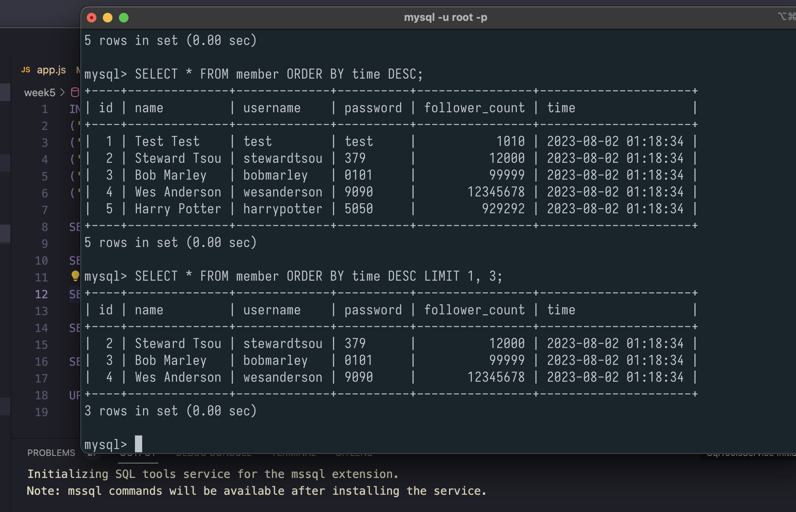

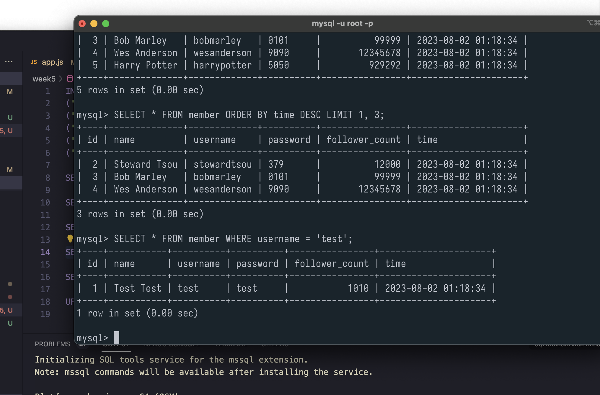

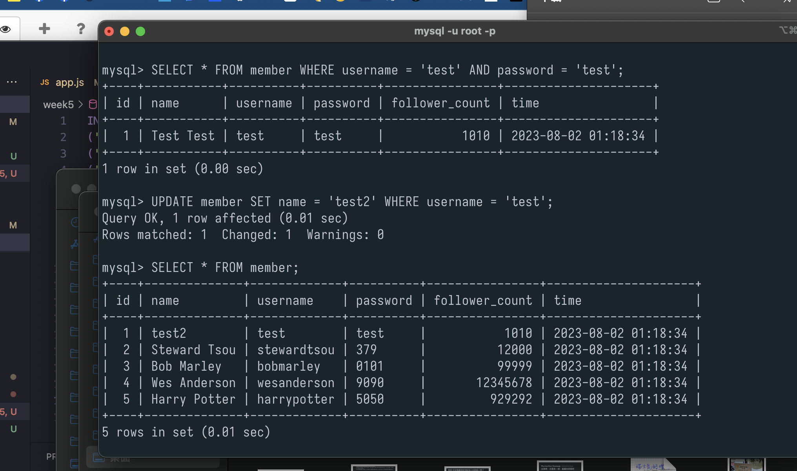

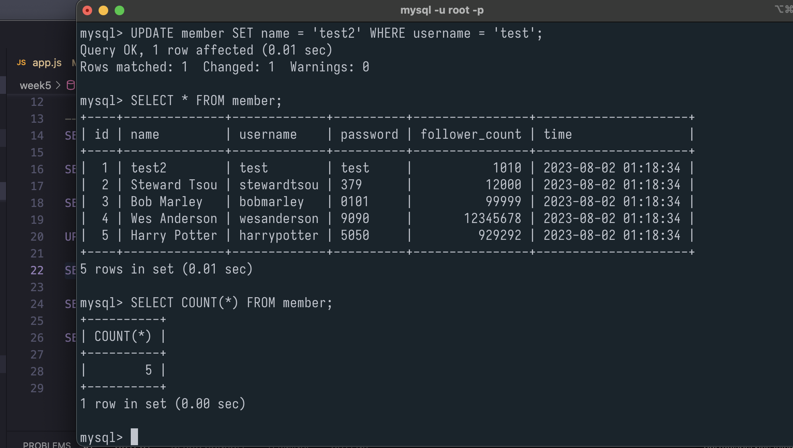


Task 4

```sql
--unordered list bulletpoint 1
SELECT COUNT(*) FROM member;

--unordered list bulletpoint 2
SELECT SUM(follower_count) FROM member;

--unordered list bulletpoint 3
SELECT AVG(follower_count) FROM member;
```

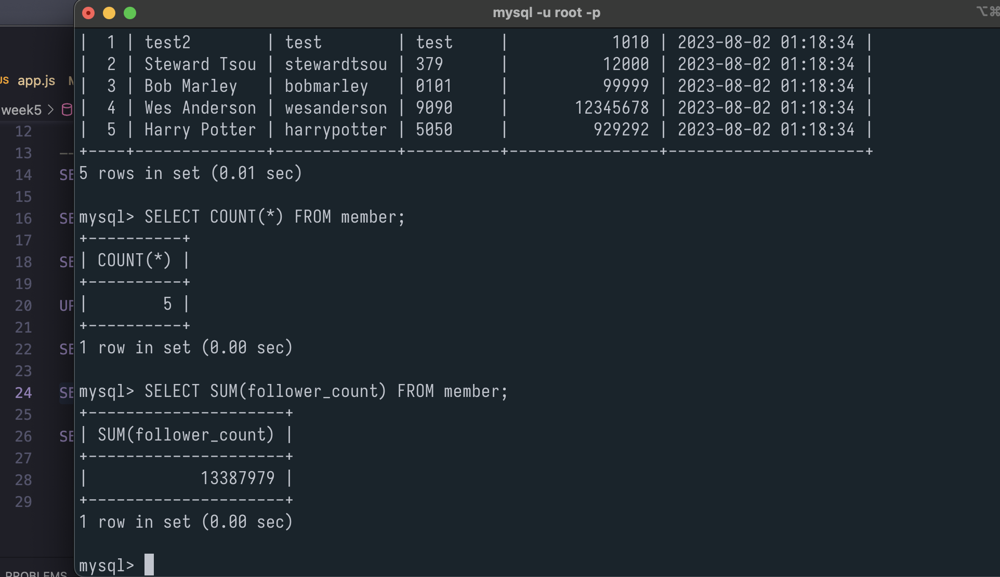

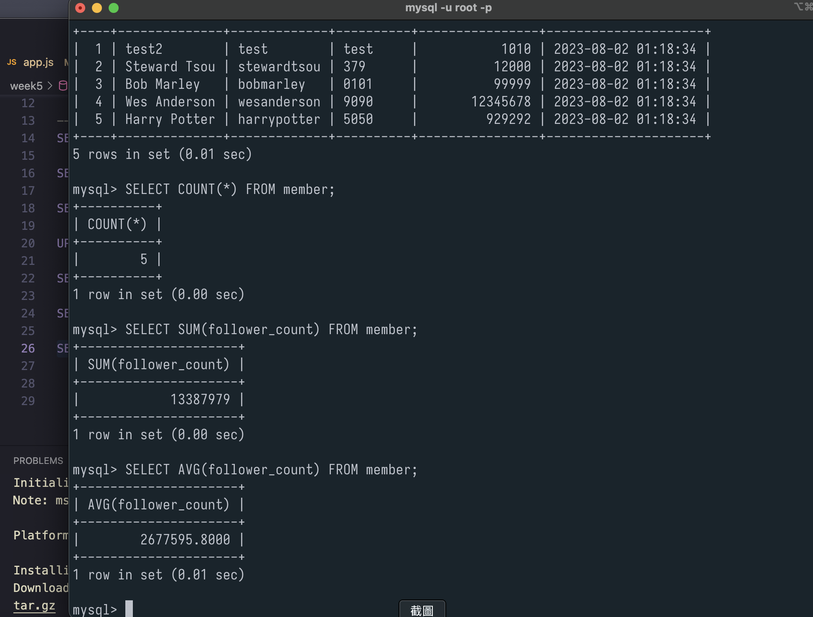

Task 5

```sql
-- ordered list 1.

CREATE TABLE message (
    id BIGINT NOT NULL AUTO_INCREMENT,
    member_id BIGINT NOT NULL,
    content VARCHAR(255) NOT NULL,
    like_count INT UNSIGNED NOT NULL DEFAULT 0,
    time DATETIME NOT NULL DEFAULT CURRENT_TIMESTAMP,
    PRIMARY KEY (id),
    FOREIGN KEY (member_id) REFERENCES member(id)
);

-- create data with rand() & floor(), pseudo-random data

-- unordered list bulletpoint 1
SELECT message.*, member.name 
FROM message 
INNER JOIN member ON message.member_id = member.id;

-- bulletpoint 2
SELECT message.*, member.name 
FROM message 
INNER JOIN member ON message.member_id = member.id
WHERE member.username = 'test';

-- bulletpoint 3
SELECT AVG(message.like_count) AS average_likes 
FROM message 
INNER JOIN member ON message.member_id = member.id 
WHERE member.username = 'test';


```

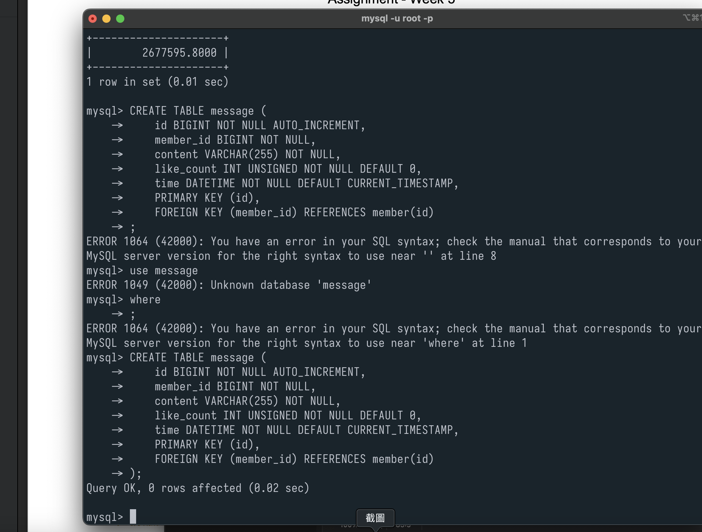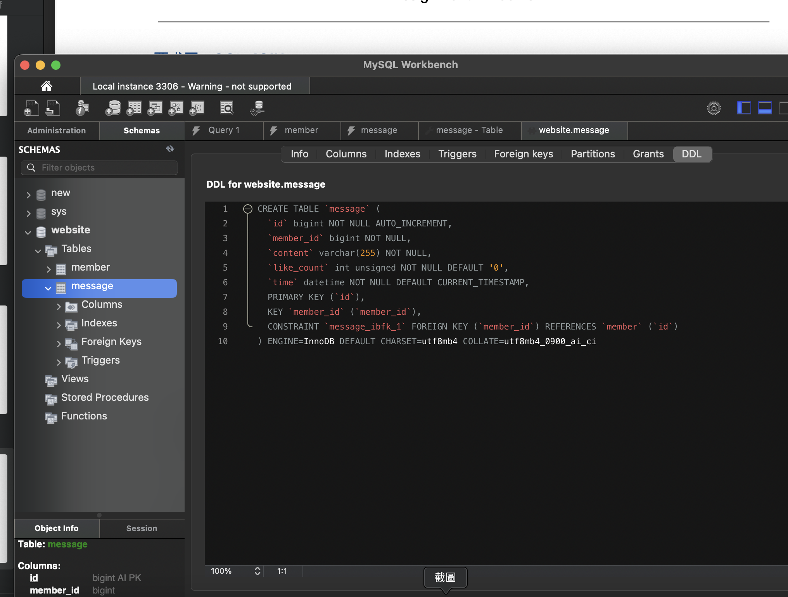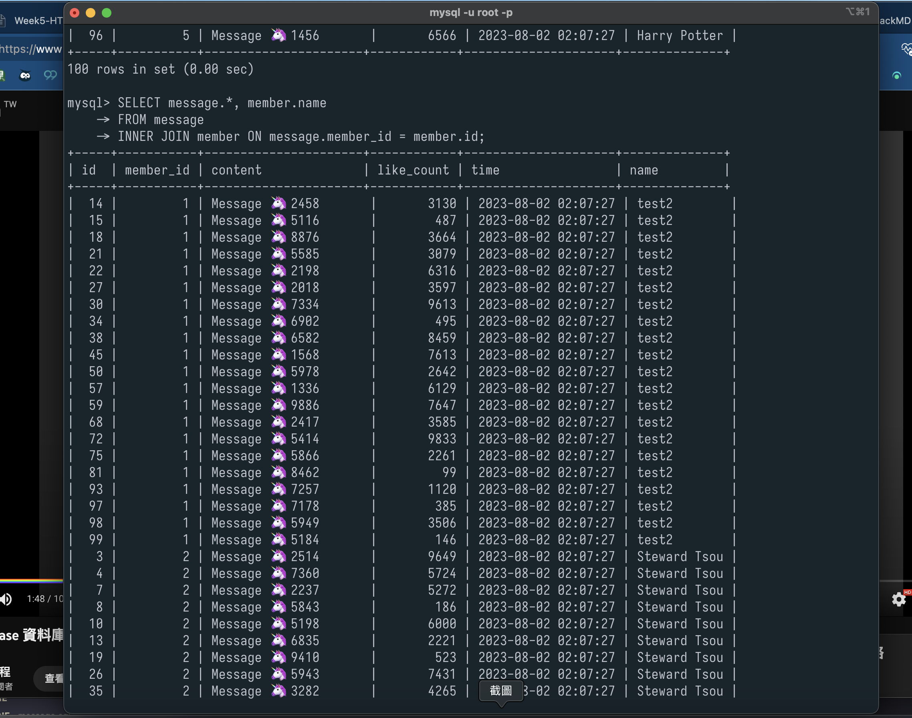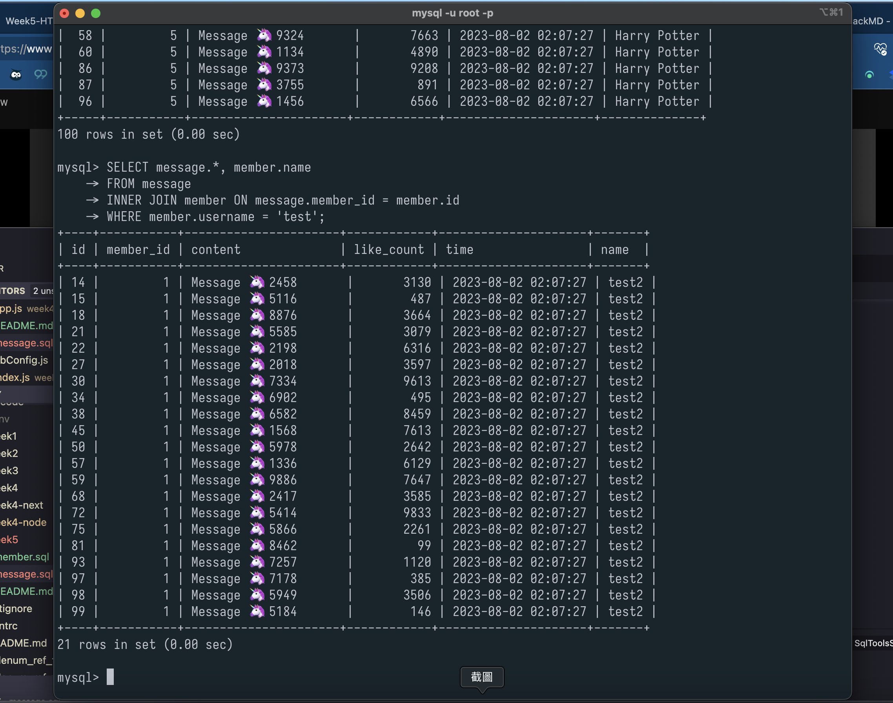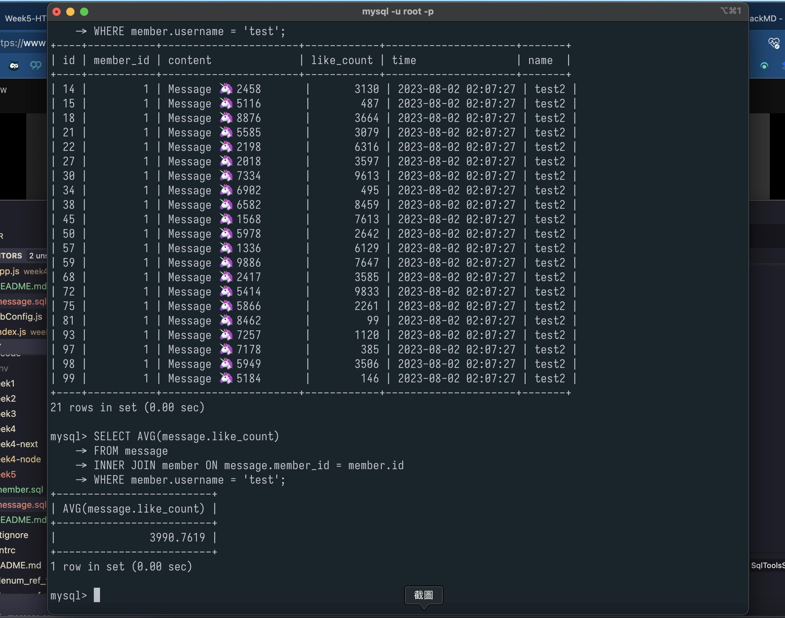
